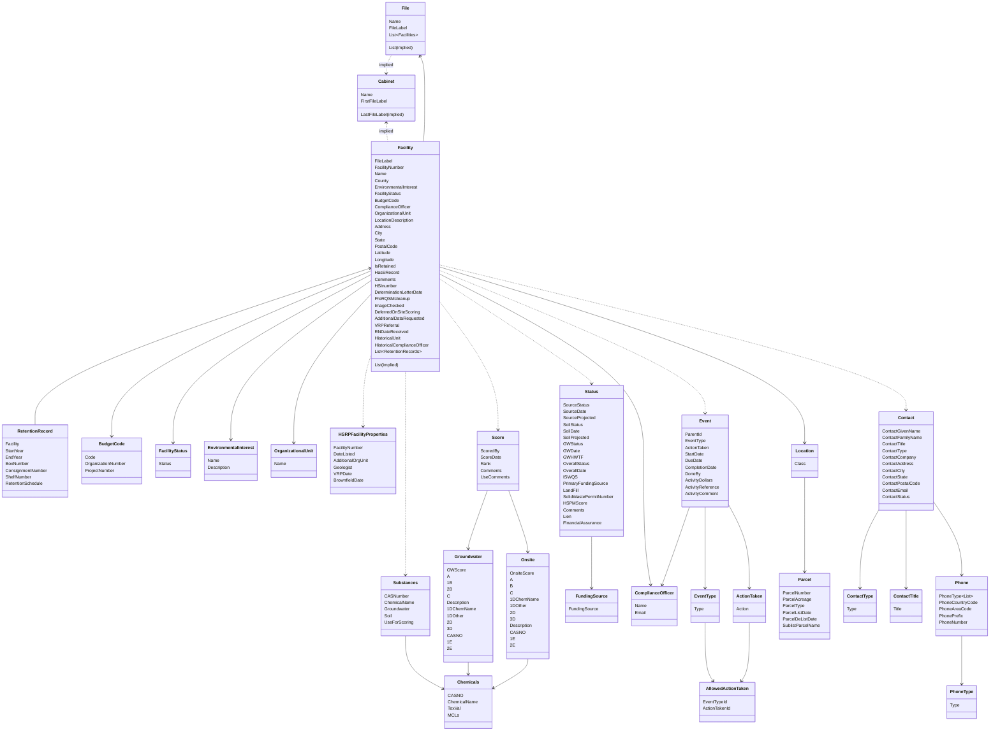

# FMS entity relationship diagram

```mermaid

classDiagram
    File ..> Cabinet : implied
    File <-- Facility
    Cabinet <.. Facility : implied
    Facility <-- RetentionRecord
    Facility --> BudgetCode
    Facility --> FacilityStatus
    Facility --> EnvironmentalInterest
    Facility --> OrganizationalUnit
    Facility ..> HSRPFacilityProperties
    Facility ..> Substances
    Facility ..> Score
    Facility ..> Status
    Facility --> ComplianceOfficer
    Facility ..> Event
    Facility --> Location
    Facility ..> Contact
    Score --> Groundwater
    Score --> Onsite
    Location --> Parcel
    Contact --> ContactType
    Contact --> ContactTitle
    Contact --> Phone
    Phone --> PhoneType
    Status --> FundingSource
    Substances --> Chemicals
    Groundwater --> Chemicals
    Onsite --> Chemicals
    Event --> ComplianceOfficer
    Event --> EventType
    Event --> ActionTaken
    EventType --> AllowedActionTaken
    ActionTaken --> AllowedActionTaken

%% Classes

class File {
    Name
    FileLabel
    List~Facilities~

    List<Cabinets> (implied)
}

class Cabinet {
    Name
    FirstFileLabel

    LastFileLabel (implied)
}

class Facility {
    FileLabel
    FacilityNumber
    Name
    County
    EnvironmentalInterest
    FacilityStatus
    BudgetCode
    ComplianceOfficer
    OrganizationalUnit
    LocationDescription
    Address
    City
    State
    PostalCode
    Latitude
    Longitude
    IsRetained
    HasERecord
    Comments
    HSInumber
    DeterminationLetterDate
    PreRQSMcleanup
    ImageChecked
    DeferredOnSiteScoring
    AdditionalDataRequested
    VRPReferral
    RNDateReceived
    HistoricalUnit
    HistoricalComplianceOfficer
    List~RetentionRecords~

    List<Cabinets> (implied)
}

class HSRPFacilityProperties {
    FacilityNumber
    DateListed
    AdditionalOrgUnit
    Geologist
    VRPDate
    BrownfieldDate
}

class RetentionRecord {
    Facility
    StartYear
    EndYear
    BoxNumber
    ConsignmentNumber
    ShelfNumber
    RetentionSchedule
}

class Location {
    Class
}

class Parcel {
    ParcelNumber
    ParcelAcreage
    ParcelType
    ParcelListDate
    ParcelDeListDate
    SublistParcelName
}

class Contact {
    ContactGivenName
    ContactFamilyName
    ContactTitle
    ContactType
    ContactCompany
    ContactAddress
    ContactCity
    ContactState
    ContactPostalCode
    ContactEmail
    ContactStatus
} 

class Phone {
    PhoneType~List~
    PhoneCountryCode
    PhoneAreaCode
    PhonePrefix
    PhoneNumber
}

class Score {
    ScoredBy
    ScoreDate
    Rank
    Comments
    UseComments
}

class Groundwater {
    GWScore
    A
    1B
    2B
    C
    Description
    1DChemName
    1DOther
    2D
    3D
    CASNO
    1E 
    2E
}

class Onsite {
    OnsiteScore
    A 
    B 
    C 
    1DChemName
    1DOther 
    2D
    3D
    Description
    CASNO
    1E 
    2E
}

class Substances {
    CASNumber
    ChemicalName
    Groundwater
    Soil
    UseForScoring
}

class Status {
    SourceStatus
    SourceDate
    SourceProjected
    SoilStatus
    SoilDate
    SoilProjected
    GWStatus
    GWDate 
    GWHWTF
    OverallStatus
    OverallDate
    ISWQS
    PrimaryFundingSource
    LandFill
    SolidWastePermitNumber
    HSPMScore
    Comments
    Lien
    FinancialAssurance
}

class Event {
    ParentId
    EventType
    ActionTaken
    StartDate
    DueDate
    CompletionDate
    DoneBy
    ActivityDollars
    ActivityReference
    ActivityComment
}

%% Lookup tables

class EnvironmentalInterest {
    Name
    Description
}

class BudgetCode {
    Code
    OrganizationNumber
    ProjectNumber
}

class OrganizationalUnit {
    Name
}

class FacilityStatus {
    Status
}

class ComplianceOfficer {
    Name
    Email
}

class Chemicals {
    CASNO
    ChemicalName
    ToxVal
    MCLs
}

class FundingSource {
    FundingSource
}

class ContactType {
    Type
}

class ContactTitle {
    Title
}

class PhoneType {
    Type
}

class EventType {
    Type
}

class ActionTaken {
    Action
}

class AllowedActionTaken {
    EventTypeId
    ActionTakenId
}

```
