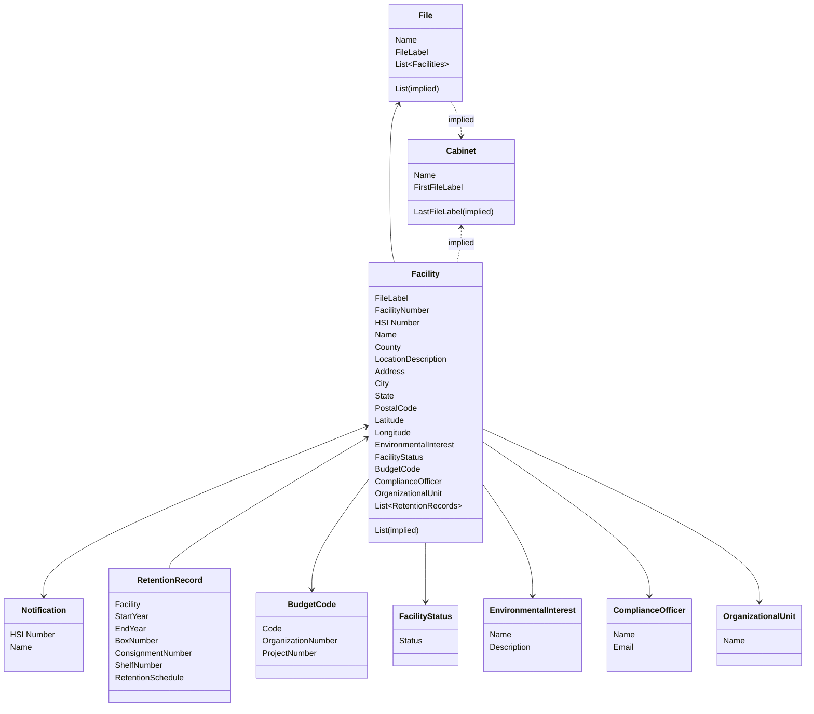

# FMS entity relationship diagram

```mermaid

classDiagram
    File ..> Cabinet : implied
    File <-- Facility
    Cabinet <.. Facility : implied

    Facility <--> Notification
    Facility <-- RetentionRecord
    Facility --> BudgetCode
    Facility --> FacilityStatus
    Facility --> EnvironmentalInterest
    Facility --> ComplianceOfficer
    Facility --> OrganizationalUnit

%% Classes

class File {
    Name
    FileLabel
    List~Facilities~

    List<Cabinets> (implied)
}

class Notification {
    HSI Number
    Name
}

class Cabinet {
    Name
    FirstFileLabel

    LastFileLabel (implied)
}

class Facility {
    FileLabel
    FacilityNumber
    HSI Number
    Name
    County
    LocationDescription
    Address
    City
    State
    PostalCode
    Latitude
    Longitude
    EnvironmentalInterest
    FacilityStatus
    BudgetCode
    ComplianceOfficer
    OrganizationalUnit
    List~RetentionRecords~

    List<Cabinets> (implied)
}

class RetentionRecord {
    Facility
    StartYear
    EndYear
    BoxNumber
    ConsignmentNumber
    ShelfNumber
    RetentionSchedule
}

class EnvironmentalInterest {
    Name
    Description
}

%% Lookup tables

class BudgetCode {
    Code
    OrganizationNumber
    ProjectNumber
}

class OrganizationalUnit {
    Name
}

class FacilityStatus {
    Status
}

class ComplianceOfficer {
    Name
    Email
}

```
