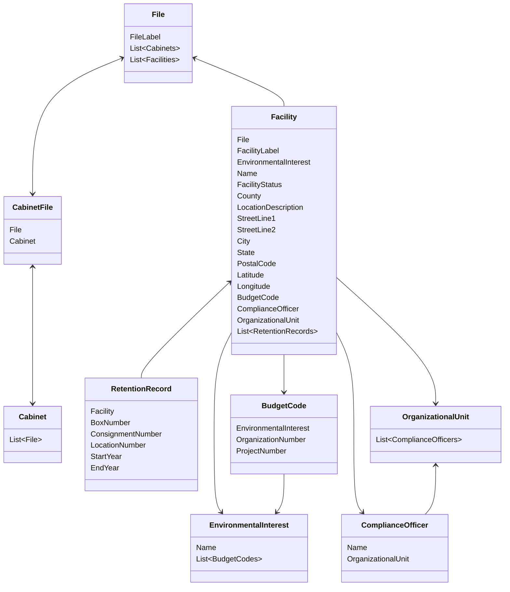

# FMS entity relationship diagram

```mermaid

classDiagram
    File <--> CabinetFile
    CabinetFile <--> Cabinet
    File <-- Facility
        
    Facility <-- RetentionRecord
    Facility --> BudgetCode
    Facility --> EnvironmentalInterest
    Facility --> ComplianceOfficer
    Facility --> OrganizationalUnit

    BudgetCode --> EnvironmentalInterest

    OrganizationalUnit <-- ComplianceOfficer

%% Classes

class File {
    FileLabel
    List~Cabinets~
    List~Facilities~
}

class CabinetFile{
    File
    Cabinet
}

class Cabinet {
    List~File~
}

class Facility {
    File
    FacilityLabel
    EnvironmentalInterest
    Name
    FacilityStatus
    County
    LocationDescription
    StreetLine1
    StreetLine2
    City
    State
    PostalCode
    Latitude
    Longitude
    BudgetCode
    ComplianceOfficer
    OrganizationalUnit
    List~RetentionRecords~
}

class RetentionRecord {
    Facility
    BoxNumber
    ConsignmentNumber
    LocationNumber
    StartYear
    EndYear
}

class EnvironmentalInterest {
    Name
    List~BudgetCodes~
}

%% Lookup tables

class BudgetCode {
    EnvironmentalInterest
    OrganizationNumber
    ProjectNumber
}

class OrganizationalUnit {
    List~ComplianceOfficers~
}

class ComplianceOfficer {
    Name
    OrganizationalUnit
}

```
