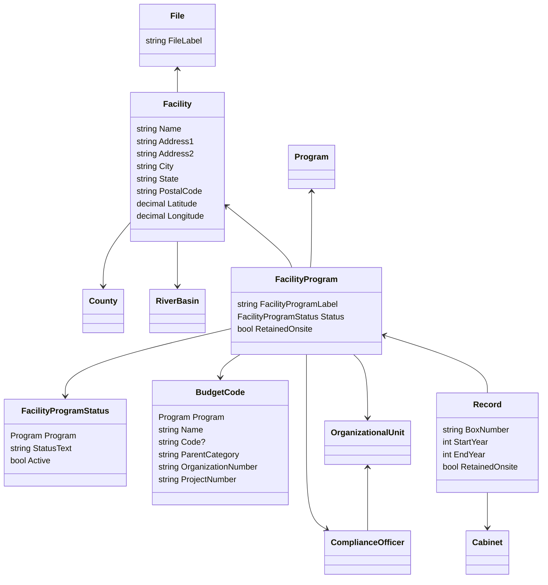

# FMS entity relationship diagram

```mermaid

classDiagram
    File <-- Facility

    Facility --> County
    Facility --> RiverBasin
    Facility <-- FacilityProgram
        
    Program <-- FacilityProgram

    FacilityProgram --> ComplianceOfficer
    FacilityProgram --> FacilityProgramStatus
    FacilityProgram --> BudgetCode
    FacilityProgram --> OrganizationalUnit
    FacilityProgram <-- Record

    OrganizationalUnit <-- ComplianceOfficer

    Record --> Cabinet

%% Classes

class File {
    string FileLabel
}

class Facility {
    string Name
    string Address1
    string Address2
    string City
    string State
    string PostalCode
    decimal Latitude
    decimal Longitude
}

class FacilityProgram {
    string FacilityProgramLabel
    FacilityProgramStatus Status
    bool RetainedOnsite
}

class Record {
    string BoxNumber
    int StartYear
    int EndYear
    bool RetainedOnsite
}

%% Lookup tables

class FacilityProgramStatus {
    Program Program
    string StatusText
    bool Active
}

class BudgetCode {
    Program Program
    string Name
    string Code?
    string ParentCategory
    string OrganizationNumber
    string ProjectNumber
}

```
