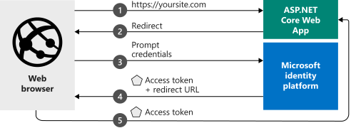

# FMS User accounts

FMS uses the Georgia Technology Authority Azure AD for account setup and login. 
See the [Azure Portal](https://portal.azure.com/#blade/Microsoft_AAD_RegisteredApps/ApplicationMenuBlade/Overview/appId/8a4c7829-92fa-4363-b257-c97e38f7711f/isMSAApp/) 
for application registration info.

[Permissions](https://learn.microsoft.com/en-us/entra/identity-platform/permissions-consent-overview) 
requested from Azure AD are:

* openid (included by default)
* profile (included by default)

The ObjectId claim is stored to identify the user. (See 
[Use claims to reliably identify a user](https://learn.microsoft.com/en-us/entra/identity-platform/id-token-claims-reference#use-claims-to-reliably-identify-a-user).)

Email address and name are stored for display/search within the application.

## Configuration

Add the following section to `appsettings.{Environment}.json`:

```json
  "AzureAd": {
    "Instance": "https://login.microsoftonline.com/",
    "Domain": "gets.onmicrosoft.com",
    "TenantId": "[Enter the Directory/Tenant ID from the Azure portal]",
    "ClientId": "[Enter the Application/Client ID from the Azure portal]",
    "ClientSecret": "[Enter a Client Secret from the Azure portal]"
  },
```

## External login flow diagram


